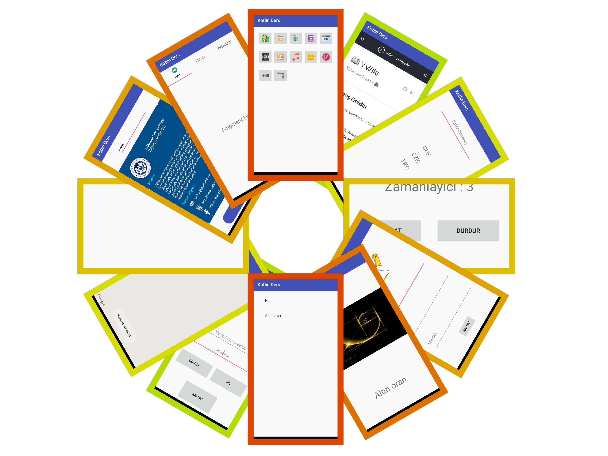

# 👨‍🏫 KotlinDers

Kotlin dili üzerine ders çalışma notlarım

> Debug sürümünü [buradan](../res/kotlinders-debug.apk) indirebilirsin

## 👮‍ Gereksinimler

- **Google Maps API KEY**: `app/src/debug/res/values/google_maps_api.xml`

## 📸 Uygulamadan Görüntüler

## 💖 Destek ve İletişim

​[​​](https://github.com/yedhrab) [​​](https://www.linkedin.com/in/yemreak/) [​​](https://yemreak.com/) [​​](mailto::yedhrab@gmail.com?subject=YBilgiler%20%7C%20Github)​

​[​](https://www.patreon.com/yemreak/)

## 🔏 Lisans

**The** [**MIT License**](https://choosealicense.com/licenses/mit/) **© Yunus Emre Ak**

